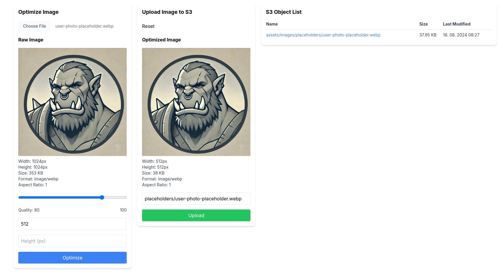

# S3 Asset Uploader with Sharp optimization

Simple S3 image asset uploader with Sharp optimization. It is very simple and barebones, but it does the job.
- In future I plan to extend this to also support videos and documents.

Run it on localhost to optimize and upload images to S3. Retrieved links of uploaded images point to Cloudfront and can be used in production.

## Preview


## Pre-requisites

1) Setup S3 bucket with Cloudfront distribution in front of it. This app returns Cloudfront links after you upload the image. [This video](https://www.youtube.com/watch?v=kbI7kRWAU-w) can help you with that.
2) Create IAM user with following policy (replace "your-bucket-name" with your actual bucket name)
```
{
    "Version": "2012-10-17",
    "Statement": [
        {
            "Effect": "Allow",
            "Action": [
                "s3:GetObject",
                "s3:PutObject",
                "s3:DeleteObject",
                "s3:ListBucket"
            ],
            "Resource": [
                "arn:aws:s3:::blazing-peon-images",
                "arn:aws:s3:::blazing-peon-images/*"
            ]
        }
    ]
}
```

## How to setup
1) Download or git clone this repo
2) Create .env file based on .env.example and place it in the root of the project
    - The region needs to be us-east-1 for Cloudfront to work (it is global, but according to AWS it has to be configured in us-east-1)
3) Run `npm run install` or `yarn install` or `pnpm install` (I use pnpm, but other package managers should work too)
4) Run `npm run dev` or `yarn dev` or `pnpm dev` to start the server
5) Open your browser and go to `http://localhost:3010`

## How to use
1) **Run it on localhost** <small>(npm run dev)</small>
- <small>#1 Optimization Form</small>
2) **Select image from filesystem**
3) **Fill in quality and size** <small>(at least height or width has to be filled in, Sharp will calculate the other parameter automatically)</small>
4) **Click optimize** <small>-> optimized image will be previewed in the Upload Form</small>
- <small>#2 Upload Form</small>
5) **Fill in the new image name** (technically S3 namespace) <small>-> it will be automatically prefixed with assets/</small>
6) **Click upload** <small>-> image will be uploaded to S3 bucket and Cloudfront link will be returned</small>
