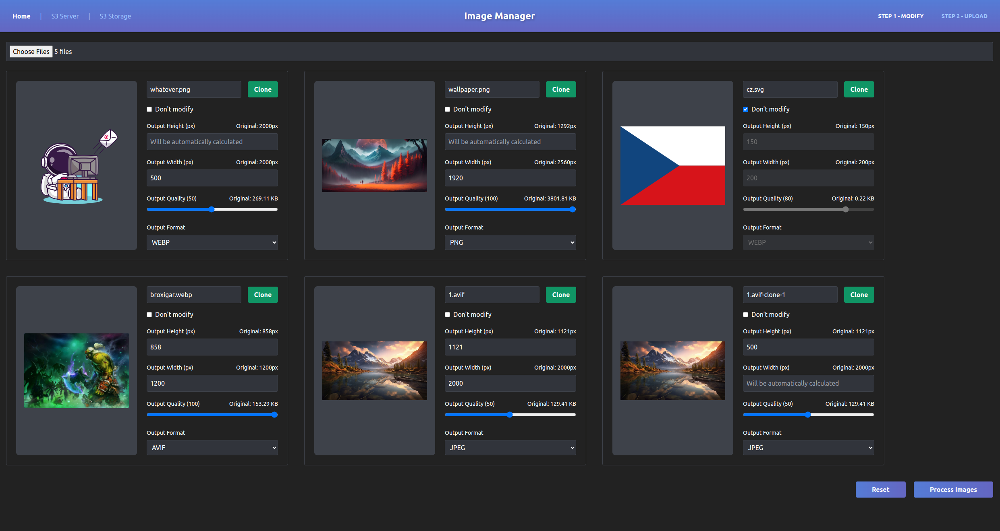
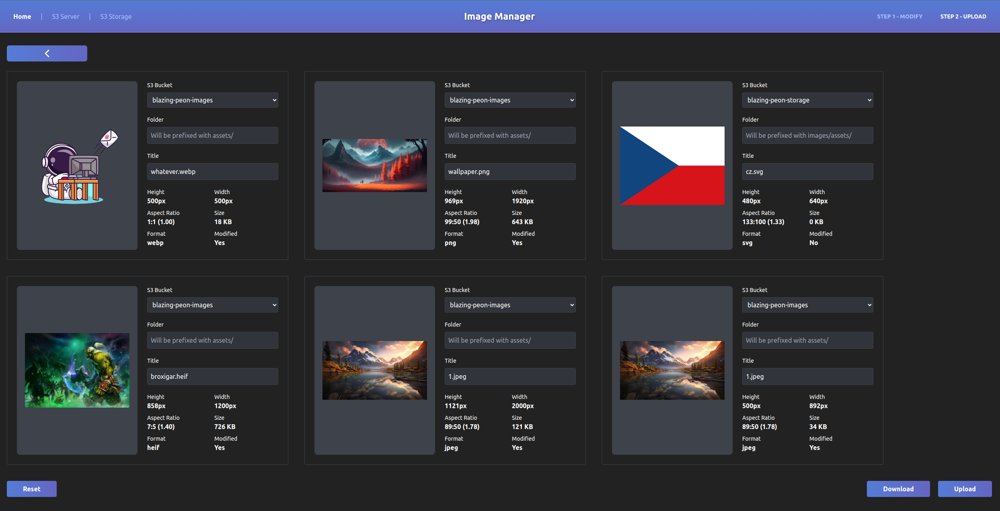
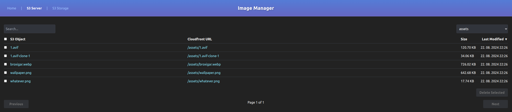
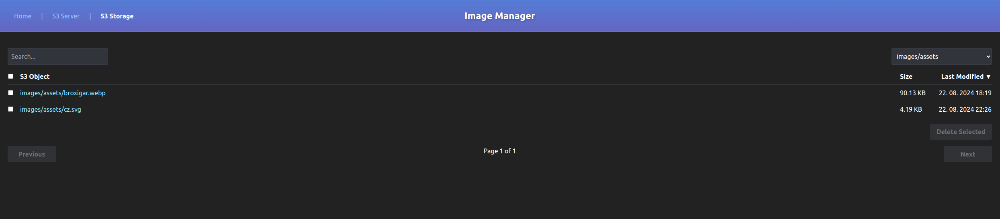

# S3 Image Manager

This simple S3 image manager allows you to:
- Optimize images with Sharp
   - Change quality
   - Change format
   - Resize
   - Clone (to create multiple versions of the same image)
- Download processed images
- Upload images to S3
- Search images in S3
- Delete images in S3

Run it on localhost to optimize and upload images to S3. Retrieved links of uploaded images point to Cloudfront and can be used in production.

## Preview

### Modification


### Upload/Download


### S3 for serving images


## S3 for storing images


## Pre-requisites

1) Setup two AWS S3 buckets - one is for serving images (server-bucket) via Cloudfront distribution (CDN) and second is for storing raw images (storage-bucket)
   - <small>S3 bucket for storage is optional</small>
   - <small>Make sure to enable versioning in your S3 buckets, otherwise you might accidentally delete your images</small>
   - <small>[How to setup a Cloudfront distribution](https://www.youtube.com/watch?v=kbI7kRWAU-w)</small>
2) Create IAM user with following policy (replace "server-bucket-name" and "storage-bucket-name" with your actual bucket name)
```
{
    "Version": "2012-10-17",
    "Statement": [
        {
            "Effect": "Allow",
            "Action": [
                "s3:GetObject",
                "s3:PutObject",
                "s3:DeleteObject",
                "s3:ListBucket"
            ],
            "Resource": [
                "arn:aws:s3:::server-bucket-name",
                "arn:aws:s3:::server-bucket-name/*",
                "arn:aws:s3:::storage-bucket-name/*",
                "arn:aws:s3:::storage-bucket-name/*"
            ]
        }
    ]
}
```

## How to setup
1) Download or git clone this repo
2) Create .env file based on .env.example and place it in the root of the project
    - The region needs to be us-east-1 for Cloudfront to work (it is global, but according to AWS it has to be configured in us-east-1)
3) Run `npm run install` or `yarn install` or `pnpm install` (I use pnpm, but other package managers should work too)
4) Run `npm run dev` or `yarn dev` or `pnpm dev` to start the server
5) Open your browser and go to `http://localhost:3010`

## How to use
1) **Run it on localhost** <small>(npm run dev)</small>
- <small>#1 Optimization Form</small>
2) **Select image from filesystem**
3) **Fill in quality and size** <small>(at least height or width has to be filled in, Sharp will calculate the other parameter automatically)</small>
4) **Click optimize** <small>-> optimized image will be previewed in the Upload Form</small>
- <small>#2 Upload Form</small>
5) **Fill in the new image name** (technically S3 namespace) <small>-> it will be automatically prefixed with assets/</small>
6) **Click upload** <small>-> image will be uploaded to S3 bucket and Cloudfront link will be returned</small>

## Notes
1) Animations / GIFs are not supported